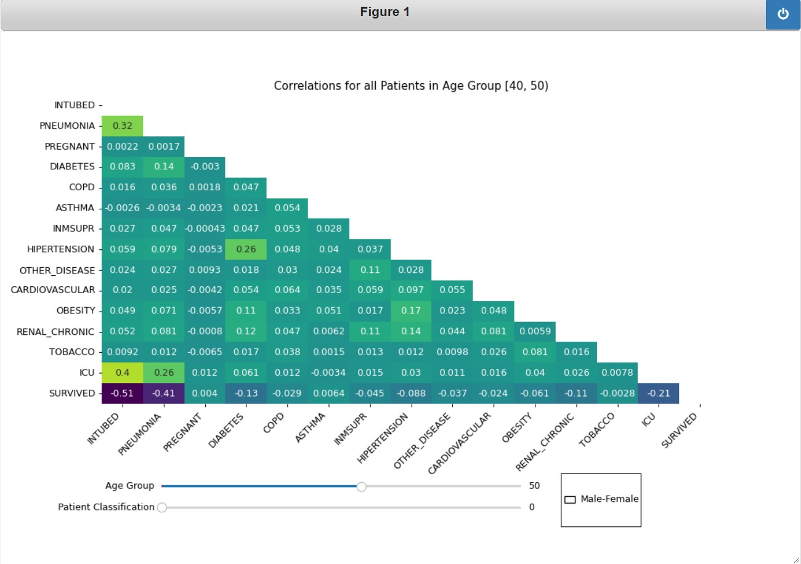
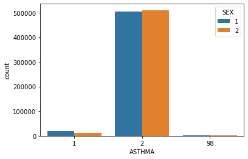

# Predicting Covid-19 Patient Mortality with Deep Learning

A predictive model on Covid-19 patient mortality is presented here. The model is trained on a dataset provided by the Mexican government ([link](https://datos.gob.mx/busca/dataset/informacion-referente-a-casos-covid-19-en-mexico)), which is also available at Kaggle ([link](https://www.kaggle.com/datasets/meirnizri/covid19-dataset)).

Upon receiving the dataset, we perform exploratory data analysis (EDA). We discovered features associated with high mortality.

<table>
<thead><tr>
<th style="text-align:center"></th>
<th style="text-align:center"></th>
</tr>
</thead>
<tbody>
<tr>
<td style="text-align:center"></td>
<td style="text-align:center"></td>
</tr>
</tbody>
</table>

More precisely, the following classes of Covid-19 patients:
* patients on ventilators
* ICU patients
* patients with air sacs inflammation

are negatively correlated with survival. This phenomenon shows across most age groups, and matches a conclusion made by [Mahendra-Nuchin-Kumar-Shreedhar-Mahesh](https://pubmed.ncbi.nlm.nih.gov/33966261/).

During EDA, we discover the dataset handles missing data by declaring its value to be one of 97, 98 and 99. Take the "asthma" feature, for instance, the missing data can be insignificant.

On the other hand, there are features with large sparsity, preventing them from being dropped. There are also features indicating a patient's medical conditions (such as asthma, diabetes, etc), preventing us to replace their values. Hence, we performed a data cleaning,  which increased the dense part of the dataset (i.e., the subset of samples with no missing values at all) from 7.33% to 97.24%. Our deep learning model is trained on the dense part.

Our deep learning model is a convolutional neural network constructed under the framework `tensorflow`.

We perform a 60-20-20 split on the dense part. The model is then trained, validated and tested.

Using a confusion matrix and a classification report, our model performance is

Our work is documented in the Jupyter notebook `meirnizri_covid19_dataset.ipynb` ([html](https://htmlpreview.github.io/?https://github.com/virchan/covid19_deep_learning/blob/main/meirnizri_covid19_dataset.html)). A copy `covid19.h5` of our model is also provided here.

Finally, one of the [author](https://github.com/virchan)'s portfolio projects on data science and machine learning. No medical advice is given here.

